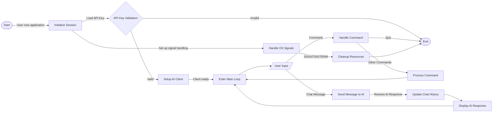
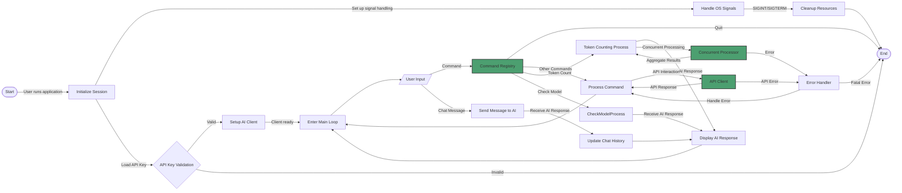

<pre>
   ______      ______           ___    ____
  / ____/___  / ____/__  ____  /   |  /  _/
 / / __/ __ \/ / __/ _ \/ __ \/ /| |  / /  
/ /_/ / /_/ / /_/ /  __/ / / / ___ |_/ /     A Rich Terminal Interface Chat
\____/\____/\____/\___/_/ /_/_/  |_/___/     Written in Go. Build Simple, Secure, Scalable Systems with Go.

Copyright (©️) 2024 @H0llyW00dzZ All rights reserved.
</pre>

[](https://github.com/H0llyW00dzZ/GoGenAI-Terminal-Chat/blob/master/go.mod#L3)
[](https://pkg.go.dev/github.com/H0llyW00dzZ/GoGenAI-Terminal-Chat)
[](https://goreportcard.com/report/github.com/H0llyW00dzZ/GoGenAI-Terminal-Chat)

**Note:** This repository is a work in progress (WIP).

**Estimated Time of Arrival (ETA):** **Unknown**. *This project is developed on a personal basis during my free time and is not associated with any company or enterprise endeavors.*

<p align="center">
  
</p>

## 🤔 Why Continue Development?

Interesting to built it in terminal after touring journey through the Go programming language, plus exploring Google's AI capabilities (currently in beta with Gemini).

> [!NOTE]
> This repository is specifically designed to adhere to idiomatic Go principles. 🤪

### 🛠️ Continued Development: Rationale and Benefits

- Embarking on a development journey that combines the robustness of the Go programming language with Google's cutting-edge AI capabilities (presently in beta with the Gemini model) offers several compelling advantages. This decision to develop a terminal-based application stems from a thorough exploration of Go's features and Google AI's potential.

### ⚖️ Scalability & Stability

- Developing in Go promotes scalability. Its performance-centric design supports concurrent processing and efficient resource management, making it an excellent choice for applications that need to scale seamlessly with increasing demand.

- Go's memory management and static typing significantly reduce the occurrence of critical bugs such as memory leaks, which are prevalent in interpreted languages. This stability is crucial for long-running terminal applications that interact with AI services.

> [!NOTE]
> `Memory leaks` are a critical concern, particularly in AI development. Go's approach to memory management sets it apart, as it mitigates such issues more effectively than some other languages. This is in stark contrast to numerous repositories in other languages where memory leaks are a frequent and often confusing problem (that I don't fucking understand when looks other repo in `github`).

### 🛡️ Security

- Go's strong typing and compilation checks contribute to a more secure codebase, effectively minimizing critical security issues often encountered in dynamically typed languages,
for example in `GitHub` that I don't fucking understand.

### 🚨 Problem Isolation

- When issues arise, Go's explicit error handling makes it easier to compare and isolate problems. This clarity ensures that when an issue occurs, it can often be determined that the cause is external to the Go application, such as an issue with the Operating System, AI Services (Google AI) for example about AI Service is that a fucking google apis are unstable.


***Fun Fact***: ***Did You Know?*** If your `Go` code resembles a jungle of `if` statements (think 10+ nested layers – a big no-no!), it's less `Go` and more `Stop-and-ask-for-directions`. Flatten those conditionals and let your code run as smoothly as a greased `gopher` on a slip 'n slide! 🤪

## ✨ Current Features

- **Terminal-Based Interaction**: Experience AI chatting within the comfort of your terminal, with a focus on simplicity and efficiency.
- **Session Chat History**: Maintain a transcript of your dialogue, capturing both queries and AI responses for a continuous conversational flow.
- **Intelligent Shutdown**: Benefit from built-in signal handling for a smooth exit process, ensuring your session ends without disruption and with proper resource cleanup.
- **Realistic Typing Animation**: Enjoy a more lifelike interaction with a simulated typing effect that mimics human conversation timing.
> [!NOTE]
> This `Realistic Typing Animation` specialized feature is economical in terms of resource consumption (e.g, `memory,cpu`), in contrast to `front-end languages` or `other languages` that tend to be more resource-intensive.
- **Ease of Deployment**: Quickly deploy the chat application using Docker, minimizing setup time and complexity.
- **Command Handling**: Integrate special chat commands naturally within the conversation. The `:quit` command, for example, allows users to end their session in an orderly fashion. When this command is executed, it prompts a cooperative shutdown sequence with the AI, which generates an appropriate goodbye message. This thoughtful design enhances the user experience by providing a conversational closure that is both natural and polite, ensuring that the session termination is as engaging as the conversation itself.
- **Concurrency**: Leverage the power of Go's concurrency model with goroutines.
- **Minimalist Package**: `DebugOrErrorLogger`
The `DebugOrErrorLogger` package offers a streamlined and efficient logging system, designed specifically for Go applications that require robust error and debug logging capabilities with minimal overhead.

### 🛠️ 📦 Minimalist Package `DebugOrErrorLogger` Key Features

- 🔎 **Conditional Debug Logging**: The logger allows for debug messages to be conditionally output based on the `DEBUG_MODE` environment variable. When set to `true`, detailed debug information will be printed to `os.Stderr`, aiding in the development and troubleshooting process.

- 🎨 **Color-Coded Error Output**: Errors are distinctly colorized in red when logged, making them stand out in the terminal for immediate attention. This colorization helps in quickly identifying errors amidst other log outputs.

- 😱 🔋 **Panic Recovery**: A recovery function is provided to gracefully handle and log any panics that may occur during runtime. This function ensures that a panic message is clearly logged with colorized output, preventing the application from crashing unexpectedly and aiding in rapid diagnosis.

- ⚡ **Simple API**: The package exposes a simple and intuitive API, with methods for debug and error logging that accept format strings and variadic arguments, similar to the standard `Printf` and `Println` functions.

- 🔓 ⚙️ **Environment Variable Configuration**: The debug mode can be easily toggled on or off through an environment variable, allowing for flexible configuration without the need to recompile the application.

> [!NOTE]
> The `Current Features` listed above may be outdated. For the most recent feature updates, please read the documentation [`here`](https://pkg.go.dev/github.com/H0llyW00dzZ/GoGenAI-Terminal-Chat/terminal).


### ⚖️ Enhanced Scalability

- **Modular Command Framework**: The system now employs a modular command framework that maps commands to dedicated handler functions. This design simplifies the addition of new commands and the modification of existing ones, reducing complexity and improving maintainability. It's a scalable approach that can easily grow with the application's functionality, accommodating an expanding set of features without cluttering the command processing logic.
- **Streamlined Codebase**: By decoupling command logic from the main interaction flow, the codebase becomes more organized and easier to navigate. Developers can quickly identify where to add new command handlers and understand how commands are processed, leading to a more developer-friendly experience.
> [!NOTE]
> The term `Streamlined Codebase` refers to a high-level, common pattern in `Go` programming. This pattern emphasizes a clean and well-organized structure, which facilitates understanding and maintaining the code. It typically involves separating concerns, modularizing components, and following idiomatic practices to create a codebase that is both efficient and easy to work with.
- **Flexible Command Extension**: The new structure allows for the easy integration of additional commands as the system evolves. Whether it's implementing administrative controls, user preferences, or new AI features, the command framework is designed to handle growth efficiently and logically.

> [!NOTE]
> This specialized feature, better than code resembles a jungle of `if if if if` statements has been successfully integrated.

By adopting this scalable command handling system, the chat application is well-positioned to evolve alongside advancements in AI and user expectations, ensuring a robust and future-proof user experience.

> [!NOTE]  
> Subject planning to continuously improve and add features, enhancing functionality without adding unnecessary complexity. Stay tuned for updates!

**`Go`** is designed to be straightforward and efficient, avoiding the unnecessary complexities (fuck complexities, this is `go` anti complexities) often encountered in other programming languages.

### 🚀 Better Performance ⚡

- **Optimized Resource Utilization**: GoGenAI Terminal Chat is engineered to maximize performance while minimizing resource usage. By leveraging Go's efficient compilation and execution model, the application ensures rapid response times and low overhead, making it ideal for systems where resource conservation is paramount.

- **Efficient Concurrency Management**: Thanks to Go's lightweight goroutines and effective synchronization primitives, GoGenAI Terminal Chat handles concurrent operations with ease. The application can serve multiple users simultaneously without significant increases in latency or memory usage, ensuring consistent performance even under load.

### 📌 High Quality Go Codes

This repository contains high-quality Go code that focuses particularly on `Retry Policy Logic`, `Chat System Logic` and `Other`. Each function is designed for `simplicity`, deliberately avoiding unnecessary `stupid complexity`, even in scenarios that could potentially exceed a `stupid complexity` score of `10+`.

## ⚙️ Installation

To use GoGenAI Terminal Interface Chat, you need to have Docker installed on your machine. If you don't have Docker installed, please follow the [official Docker installation guide](https://docs.docker.com/get-docker/).

Once Docker is set up, you can pull the image from GitHub Packages by running:

```sh
docker pull ghcr.io/h0llyw00dzz/gogenai-terminal-chat:latest
```

> [!TIP]
> For `Master` or `Advanced` of `Go Programming`, especially those in `cloud engineering`, this `GoGenAI Terminal Interface Chat` can be run in a `Cloud Shell` (`for example, Google Cloud Shell`) without using Docker.

## Usage

To start a chat session with GoGenAI, run the following command in your terminal. Make sure to replace `YOUR_API_KEY` with the actual API key provided to you.

> [!WARNING]  
> Due this issue [`here`](https://github.com/H0llyW00dzZ/GoGenAI-Terminal-Chat/issues/120)  To start a chat session with `GoGenAI`, use a better `terminal` that can handle a `constant` in this repository or build your own os with better kernel that can handle `constant` in this repository

```sh
docker run -it --rm --name mychatapp -e API_KEY=YOUR_API_KEY ghcr.io/h0llyw00dzz/gogenai-terminal-chat:latest
```

This command will start the GoGenAI Terminal Chat application in interactive mode. You will be able to type your messages and receive responses from the AI.

### 🔓 Environment Variables

Environment variables are key-value pairs that can affect the behavior of your application. Below is a table of environment variables used in the GoGenAI-Terminal-Chat application, along with their descriptions and whether they are required.

| Variable               | Description                                                                 | Required |
|------------------------|-----------------------------------------------------------------------------|:--------:|
| `API_KEY`              | Your API key for accessing the generative AI model. Obtain a free API key [here](https://ai.google.dev/). |   Yes    |
| `DEBUG_MODE`           | Set to `true` to enable `DEBUG_MODE`, or `false` to disable it.             |   No     |
| `SHOW_PROMPT_FEEDBACK` | Set to `true` to display prompt feedback in the response footer, or `false` to hide it. |   No     |
| `SHOW_TOKEN_COUNT`     | Set to `true` to display the token count used in the AI's response and chat history, or `false` to hide it. |   No     |


## 📸 Screenshot

### 📊 Average Consumption (Tested on Production Docker):

<p align="center">
  
</p>

> [!NOTE]
> The `Average Consumption` metrics are calculated without including the use of a storage system like a database and are based on the assumption that each function is relatively simple, with an average cyclomatic complexity of 5 as the maximum. However, consumption may increase with more complex functions (e.g., those with a cyclomatic complexity of 10 or more, which are not recommended).

#### Idle

<p align="center">
  
</p>

#### Gopher doing task

<p align="center">
  
</p>

#### Average Maximum Consumption

<p align="center">
  
</p>

> [!NOTE]
> The `Average Maximum Consumption` metrics are based on the simulation of `human` typing behavior. This involves rendering the chat responses character by character to mimic the rhythm and pace of `human` typing.

> [!WARNING]  
> These `screenshots` may be outdated due to version changes.

### 🤖 Better LLM's:
<p align="center">
  
</p>
<p align="center">
  
</p>

<p align="center">
  
</p>

<p align="center">
  
</p>

<p align="center">
  
</p>

<p align="center">
  
</p>

### Kubernetes in the wild's:
<p align="center">
  
  
  
  
  
</p>

### 🔓 ⚙️ Simple Debugging:
<p align="center">
  
</p>

> [!NOTE]
> This `🔓 ⚙️ Simple Debugging` are simple unlike shitty a complex logic `go codes` that increase of `cyclomatic complexity`

### 🤖 📝 Better LLM's Summarization:

<p align="center">
  
</p>


### Solving Math in the Terminal:
<p align="center">
  
  
</p>

## Example how it work

🤓 You: hello are you ?

🤖 AI: : I am a large language model, trained by Google.

🤓 You: I have question about k8s, How do I enable audit logging in Kubernetes, and what should I look for when analyzing the logs?

🤖 AI: To enable audit logging in Kubernetes, you can use the following steps:

1. Edit the Kubernetes API server configuration file, typically located at `/etc/kubernetes/manifests/kube-apiserver.yaml`.
2. Add the following configuration under the `audit-policy` section:

```
enabled: true
```

3. Optionally, you can configure the following settings:

   - `policyFile`: The path to a file containing the audit policy rules.
   - `logPath`: The path to the file where the audit logs will be stored.
   - `logFormat`: The format of the audit logs.
   - `maxBatchSize`: The maximum number of audit events to include in a single batch.
   - `maxBatchWait`: The maximum amount of time to wait for a batch of audit events to be filled before writing them to disk.

4. Save and restart the Kubernetes API server.

Once audit logging is enabled, you can analyze the logs to gain insights into the activity on your Kubernetes cluster. Some things you may want to look for include:

- Successful and failed authentication and authorization attempts
- Create, update, and delete operations on Kubernetes resources
- Changes to cluster configuration
- API calls that take a long time to complete
- Errors and warnings generated by the Kubernetes API server

By analyzing the audit logs, you can identify security risks, troubleshoot issues, and gain a better understanding of how your Kubernetes cluster is being used.

Here are some additional resources that you may find helpful:

- [Kubernetes Audit Logging Documentation](https://kubernetes.io/docs/tasks/debug-application-cluster/audit/)

---

### ⚡ Another Example

<p align="center">
  
</p>

```sh
$ go run cmd/main.go
```

🤖 AI: Hello! How can I assist you today?

🤓 You: I have question does this correct about "Strive for simplicity in each function (aim for a cyclomatic complexity under 5 to demonstrate expertise); simplicity is a sign of Go programming mastery." ?

🤖 AI: Yes, the statement "Strive for simplicity in each function (aim for a cyclomatic complexity under 5 to demonstrate expertise); simplicity is a sign of Go programming mastery" is generally correct.

**Cyclomatic complexity** is a measure of the complexity of a function. It is calculated by counting the number of independent paths through the function. A high cyclomatic complexity indicates that the function is difficult to understand and maintain.

**Simplicity** is a key principle of Go programming. Go code is typically concise and easy to read. This makes it easier to understand and maintain.

**Aiming for a cyclomatic complexity under 5** is a good way to ensure that your functions are simple and easy to understand. This will help you to write better code and avoid introducing bugs.

Of course, there are times when it is necessary to write functions that are more complex. However, you should always strive for simplicity whenever possible.

Here are some tips for writing simple functions:

* Use short, descriptive variable names.
* Avoid nesting loops and conditionals.
* Use functions to break down complex tasks into smaller, more manageable tasks.
* Document your functions clearly.

By following these tips, you can write simple, easy-to-understand functions that will make your code more maintainable and bug-free.

---

🤓 You: alright thx for info

🤖 AI: You're welcome! I'm glad I could be of assistance. If you have any more questions, feel free to ask.

---

🤓 You: :quit

🤖 AI: It's been a pleasure assisting you today. Remember, I'm always here if you have any more questions. Take care and have a wonderful day!

---

### GoGenAI Terminal Chat Application Overview:

The GoGenAI Terminal Chat application provides a command-line interface for users to interact with a generative AI model. The application handles user inputs, processes commands, communicates with the AI, and maintains a chat history. It is designed to be extensible and scalable to accommodate future growth and additional features.

#### ⚙️ Simple System's Architecture:

The simple architecture is designed for straightforward use cases and provides the basic functionality required for a terminal-based chat application.



#### ⚙️ Scalable System's Architecture:

The scalable architecture is designed to handle growth, allowing for the addition of new commands, improved error handling, and more complex interactions with external APIs.



> [!NOTE]
> In the diagram above, components with a `green` fill color (`#4c9f70`) are designed to be scalable, indicating that they can handle growth and increased load effectively. These components include the `Command Registry`, `API Client`, and `Concurrent Processor`.

> [!NOTE]
> The `Scalable System's Architecture` showcases an efficient handling of complexity through simplicity. In this Go application, each function is designed to maintain an average `cyclomatic complexity of 5` or `less`.

## 🙌 Contributing
Please refer to our [`Contribution Guidelines`](CONTRIBUTING.md) for detailed information on how you can contribute to this project.

## 📝 TODO

> [!NOTE]
> This is a list of tasks to improve, fix, and enhance the features of this project. The tasks are added to this README.md file to ensure they are not forgotten during the development process.

### Front-End:
- [ ] **UI for Front-End Terminal**
- [ ] **Implement a Reporting System**
> [!NOTE]
> The `Reporting System` is designed to capture and handle runtime panic events in the Go application, facilitating streamlined error reporting and analysis.
- [X] **Develop a Debug System**
- [ ] **Create a Convert Result Table feature**
> [!NOTE]
> The `Create a Convert Result Table feature` feature is designed to reformat output from the AI into a tabular structure.
- [X] **Enable Additional Responses**
> [!NOTE]
> The `Enable Additional Responses` feature is designed to permit additional responses from the AI, such as prompt feedback. To activate this feature, use the `Environment Variable Configuration`.

### Back-End:
- [ ] **Implement any unimplemented features**
- [ ] **Spawning Additional Goroutines**

  - [X] **Processing Multiple Image Datasets for Token Counting**
  - [X] **Processing Multiple Text Datasets for Token Counting**

> [!NOTE]
> The features for `Processing Multiple Image & Text Datasets for Token Counting` are protected against `race conditions` and `deadlocks`. Moreover, they can `efficiently` handle `multiple text data` or `multiple image data`.

- [ ] **Pin Each Message for a Simpler Context Prompt**
> [!NOTE]
> The `Pin Each Message for a Simpler Context Prompt` feature is designed to pin messages loaded from files such as `json/txt/md`. This feature works exceptionally well with automated or manual summarization, as opposed to when written in an `interpreted language` hahaha.
- [X] **Improve the Structure of the ChatHistory Logic for ContextPrompt**
- [ ] **Implement Gemini-Pro Vision Capabilities**
> [!NOTE]
> The `Implement Gemini-Pro Vision Capabilities` feature is strategically integrated within command functionalities, such as image comparison, image analysis, and more.
- [ ] **Develop a Scalable Configuration System**
> [!NOTE]
> This system is written in `go`, ensuring `Scalability` & `Stability`.  🤪
- [ ] **Improve Contextual Prompts for AI when the user invokes commands like `:help`**
- [ ] **Automate Summarizing Conversations**
> [!NOTE]
> The `Automate Summarizing Conversations` feature is designed to automatically summarize a conversation similarly to [ChatGPTNextWeb](https://github.com/ChatGPTNextWeb/ChatGPT-Next-Web). However, it is built in a terminal interface, making it more accessible and affordable than `OpenAI`. Furthermore, since this terminal interface is written in Go, it enables the creation of simple, secure, and scalable systems.
- [X] **Manually summarize a conversation using commands**
- [X] **Improve CommandRegistry to avoid bugs (`e.g., issues with executing a scalable command handler`)**
- [X] **Improve Conditional Debug Logging for commands**
- [X] **Improve Chat Statistic**
- [ ] **Improve `:aitranslate` commands**
> [!NOTE]
> The `Improve :aitranslate commands` aims to enhance translation capabilities, including translating from files, markdown, documents, CSVs, and potentially more. As it's written in Go, which has a powerful standard library 🤪, you can, for instance, use the command `:aitranslate :file data.csv`.
- [X] **Fix `:safety` commands**
- [X] **Improve `AIResponse` by Storing the Original AI Response in `ChatHistory`**
> [!NOTE]
> The enhancement, `Improve AIResponse by Storing the Original AI Response in ChatHistory`, involves saving the original response from the AI into `ChatHistory`. Additionally, this action automatically triggers improvements for the `Colorize` feature.
- [ ] **Leverage `ChatHistory` by automatically syncing for multi-modal use (`gemini-pro-vision`)**
> [!NOTE]
> The enhancement, `Leverage ChatHistory by automatically syncing for multi-modal use (gemini-pro-vision)`, utilizes `ChatHistory` as a highly efficient, in-memory data storage solution unlike written in `C` or other language that causing `memory leaks` . This ensures seamless synchronization and optimal performance across various modes.
- [X] **[Explicit] The `retry policy` is dynamically applied to main goroutine, allowing for independent error handling and retry attempts.**
- [ ] **[Explicit] Improve `Error` message handling to make it more dynamic.**

  - [X] **[Explicit] Each goroutine dynamically handles `Error` messages during `Count Tokens` operations, communicating through a channel.**

  ***Illustration of how it works:***

  <p align="center">
  
  </p>

  ```mermaid
  sequenceDiagram
      participant Main as Main Goroutine
      participant G1 as Goroutine 1
      participant G2 as Goroutine 2
      participant G3 as Goroutine 3
      participant Ch as Error Channel
      participant Collector as Error Collector (Known As Retry Policy)

      Main->>Ch: Create channel with capacity
      Main->>G1: Start Goroutine 1
      Main->>G2: Start Goroutine 2
      Main->>G3: Start Goroutine 3
      G1->>Ch: Send error (if any)
      G2->>Ch: Send error (if any)
      G3->>Ch: Send error (if any)
      Main->>Collector: Start collecting errors
      loop Collect errors
          Ch->>Collector: Send errors to collector
      end
      Main->>Main: Close channel after all goroutines complete
      Collector->>Main: Return first non-nil error
  ```

- [ ] **Improve `Colorize` to enhance scalability and integrate it with Standard Library Regex for better performance.**
- [ ] **Switch Model By Using Commands**

### Other:
- [ ] **Plan for Google Cloud Deployment**
> [!NOTE]
> The `Plan for Google Cloud Deployment` feature is intended to support cloud compatibility with Vertex AI capabilities once version v1.0.0 (this repository) is reached and considered stable [read here](https://pkg.go.dev/about#best-practices).

**Why?** This project is developed in compliance with the `Terms of Service` and `Privacy Policy` for `personal use`. It's important to note that this project is developed on a personal basis during my free time and is not associated with any company or enterprise endeavors. This contrasts with many companies that primarily cater to enterprise needs. For instance, `Vertex AI` capabilities can be utilized on a personal basis for tasks such as fine-tuning and using your own data, without the complexity and overhead typically associated with enterprise-level requirements.

- [ ] **Web Interface Support**
> [!NOTE]
> The `Web Interface Support` feature is designed to facilitate support for WebAssembly (WASM), leveraging its development in Go. This enables the management of chat and other functionalities locally, starting from version v1.0.0+ (probably v2) of this repository, once it is reached and deemed stable. For best practices, [read here](https://pkg.go.dev/about#best-practices).

- [X] **Go Upgrade to 1.22**

### Command Tools:
- [ ] **Calculate the Size of the Code Base Volume**

> [!NOTE]
> The `Calculate the Size of the Code Base Volume` feature is designed to assess the size of a code base. For example, it can calculate the volume of Google's Open Source projects, or Other Open Source Projects, which contain billions of lines of code written in `Go`.

- [ ] **Convert Each Function in `Go Code` to `Mermaid Markdown`**

> [!NOTE]
> The feature, `Convert Each Function in Go Code to Mermaid Markdown`, is designed to evaluate a code base. It is inspired by the Go tool `Dead Code`. For instance, it will transform each reachable function into `Mermaid Markdown` format.

- [ ] **Kubernetes instance calculator**

## 🕵️‍♂️ HACKING
Available [`here`](https://github.com/H0llyW00dzZ/GoGenAI-Terminal-Chat/security/policy)
